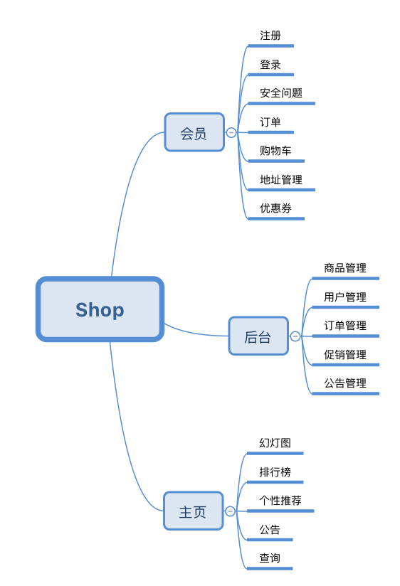

购物系统
=====================

在线商城项目，持续完善中...

## 前提条件  
- redis(Win上可以找3.0的安装包或者Docker方式,Linux和Mac就不多说了)
- Lombok插件(IDEA的话自己安装，Eclipse没试过)
- MySQL数据库(>=5.7)

## 启动服务

    com.javaniuniu.shops.ShopsApplication.main()
    
主页：[http://localhost:8081/](localhost:8081/)  
后台：[http://localhost:8081/admin/login](localhost:8081/admin/login)  

## 配置修改
可以在application.properties中修改相关配置（http服务端口、数据库配置...）

- 访问端口：server.port
- 数据库相关配置：jdbc.***
- 初始化数据脚本在`/src/main/resources/sql/`下
- 管理员:admin/123456
- 用户:javaniuniu/123456
- 1.0版本（完成）
- 1.1 完成TODO
- 1.3 增加redis
- 2.2版本，通过spring session 做session缓存
- 3.0版本, 通过redis 做session缓存
- ....
- 最终 结合sc-whorl

参考文档
- [SpringMVC——redirect重定向跳转传值](https://www.cnblogs.com/jpfss/p/9542786.html)
- [Controller 数据处理示例(Model ModelAndView redirect)](./controller.md)
- [model注解使用参考](https://github.com/minplemon/springboot-buckets/tree/master/springboot-jpa)